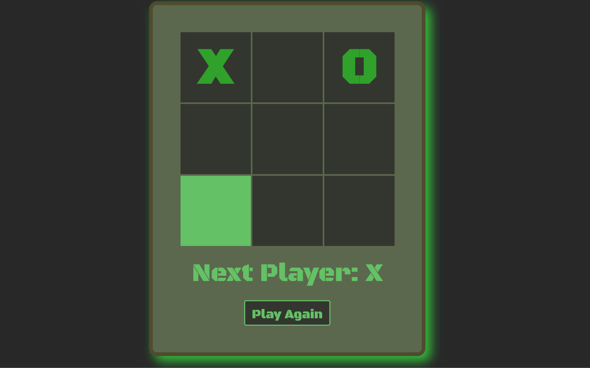

# TicTacToe_React
 This is a simple React Tic Tac Toe game created as an exercise from the MIT xPro Fullstack Development with MERN certificate program.
 

<h2>To run:</h2>
All files required to run this are included in this repository, feel free to fork it and make it your own. 

<h2>Roadmap of future improvements:</h2>
I intend to return to update the code at some point to include highlighting of the winning row at the end of the game.

<h2>Support:</h2>
Feel free to message me on LinkedIn (https://www.linkedin.com/in/anna-stegmann-77825b136/) if you have any questions.

<h2>License</h2>
MIT License Copyright (c) 2022 Anna Stegmann Permission is hereby granted, free of charge, to any person obtaining a copy of this software and associated documentation files (the "Software"), to deal in the Software without restriction, including without limitation the rights to use, copy, modify, merge, publish, distribute, sublicense, and/or sell copies of the Software, and to permit persons to whom the Software is furnished to do so, subject to the following conditions:
The above copyright notice and this permission notice shall be included in all copies or substantial portions of the Software.

THE SOFTWARE IS PROVIDED "AS IS", WITHOUT WARRANTY OF ANY KIND, EXPRESS OR IMPLIED, INCLUDING BUT NOT LIMITED TO THE WARRANTIES OF MERCHANTABILITY, FITNESS FOR A PARTICULAR PURPOSE AND NONINFRINGEMENT. IN NO EVENT SHALL THE AUTHORS OR COPYRIGHT HOLDERS BE LIABLE FOR ANY CLAIM, DAMAGES OR OTHER LIABILITY, WHETHER IN AN ACTION OF CONTRACT, TORT OR OTHERWISE, ARISING FROM, OUT OF OR IN CONNECTION WITH THE SOFTWARE OR THE USE OR OTHER DEALINGS IN THE SOFTWARE.
